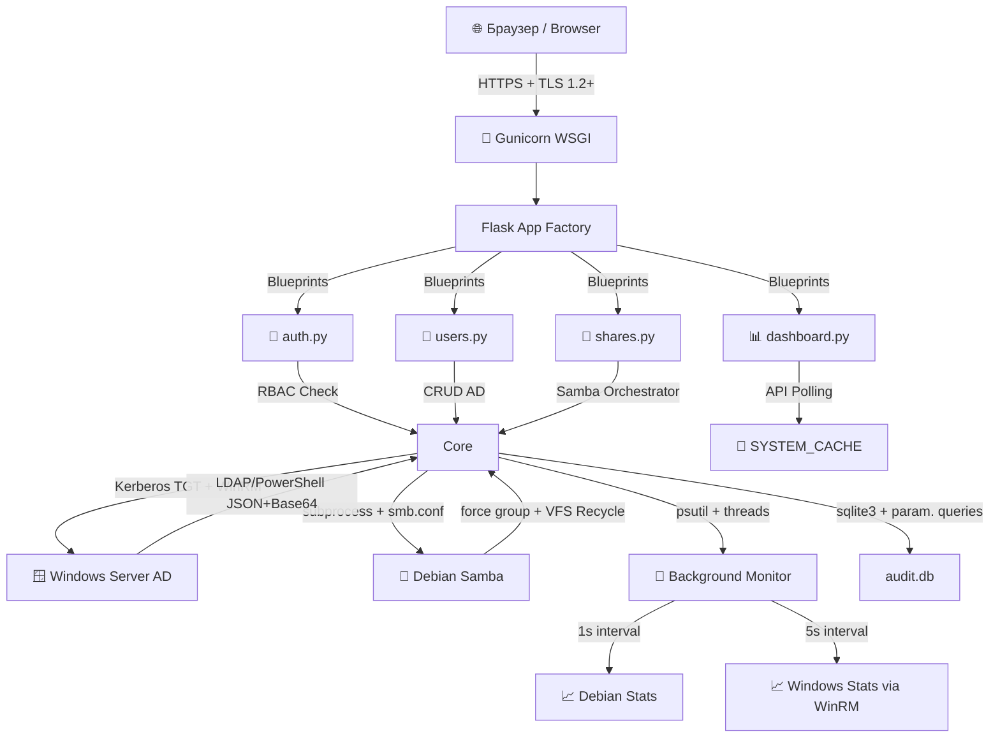

# 🛡️ WEBADMIN IAM & SIEM Panel

<div align="center">

[](https://www.python.org/)
[](https://flask.palletsprojects.com/)
[](https://web.mit.edu/kerberos/)
[](https://www.samba.org/)
[](LICENSE)
[]()

**🇷🇺 Безагентная панель управления гибридной инфраструктурой** | **🇬🇧 Agentless Hybrid Infrastructure Management Panel**

</div>

---

## 📖 Описание проекта / Project Overview

> 🇷🇺 **WEBADMIN IAM & SIEM Panel** — безагентное решение, представляющее собой веб-панель для централизованного управления гибридной инфраструктурой (Microsoft Active Directory + Linux Samba) с интегрированным модулем мониторинга информационной безопасности (SOC). Проект реализует принципы сервисно-ориентированной архитектуры (SOA), концепцию Zero Trust и полностью безагентную модель взаимодействия через WinRM/Kerberos.

> 🇬🇧 **WEBADMIN IAM & SIEM Panel** is an agentless web solution for centralized management of hybrid infrastructure (Microsoft Active Directory + Linux Samba) with an integrated Security Operations Center (SOC) monitoring module. The project implements Service-Oriented Architecture (SOA) principles, Zero Trust concepts, and a fully agentless interaction model via WinRM/Kerberos.

### 🎯 Ключевые преимущества / Key Advantages

| 🇷🇺 Преимущество | 🇬🇧 Advantage |
|-----------------|--------------|
| 🔐 **Безагентная архитектура** — управление без установки ПО на целевые системы | 🔐 **Agentless Architecture** — manage infrastructure without installing agents on target systems |
| 🛡️ **Zero Trust по умолчанию** — каждая операция валидируется на уровне домена | 🛡️ **Zero Trust by Default** — every operation validated at domain level |
| ⚡ **Асинхронный мониторинг** — многопоточный поллинг без нагрузки на серверы | ⚡ **Async Monitoring** — multi-threaded polling with zero server overhead |
| 🌐 **Гибридная совместимость** — единый интерфейс для Windows AD и Linux Samba | 🌐 **Hybrid Compatibility** — single interface for Windows AD and Linux Samba |
| 📊 **SOC-аналитика в реальном времени** — проактивное выявление уязвимостей | 📊 **Real-time SOC Analytics** — proactive vulnerability detection |

---

## ✨ Полный список возможностей / Full Feature List

### 🔐 1. Авторизация и безопасность ядра / Core Authentication & Security

| Функция / Feature | Описание / Description |
|------------------|----------------------|
| **SSO через Active Directory** | Вход по доменным учётным данным. Валидация через `System.DirectoryServices.AccountManagement` напрямую в ядре AD. |
| **RBAC (Domain Admins Only)** | Доступ к панели разрешён только участникам групп `Domain Admins` / `Администраторы домена`. Проверка на стороне контроллера. |
| **Kerberos-транспорт (RFC 4120)** | Полный отказ от NTLM. Автоматическое получение/обновление TGT-билетов, строгая проверка FQDN. |
| **Изоляция секретов** | Пароли и ключи хранятся в `.env`, не коммитятся в репозиторий. Защита от утечек через `python-dotenv`. |
| **CSRF & Path Traversal Protection** | Встроенная защита от межсайтовой подделки запросов и обхода путей при навигации по файловой системе. |

---

### 👥 2. Модуль IAM: Управление пользователями и группами AD / IAM Module: AD Users & Groups

| Функция / Feature | Описание / Description |
|------------------|----------------------|
| **Smart CRUD пользователей** | Создание учётных записей с автоматической генерацией UPN (`user@diplom.local`), проверкой на дубликаты, мгновенной привязкой к множеству групп безопасности. |
| **Валидация политик паролей** | Предотвращение логических конфликтов: нельзя одновременно выбрать «Срок действия не ограничен» + «Сменить при входе» или «Запретить смену» + «Сменить при входе». |
| **Управление статусом учётки** | Блокировка/разблокировка (`Disable-ADAccount` / `Enable-ADAccount`), принудительный сброс пароля с требованием смены при следующем входе. |
| **Фильтрация системных групп** | Автоматическое исключение `Builtin`-групп из интерфейса управления для предотвращения ошибок администрирования. |
| **Управление членством в группах** | Просмотр состава группы, добавление/удаление участников в один клик с валидацией на стороне контроллера домена. |

---

### 📁 3. Оркестратор файловых систем (Samba) / Filesystem Orchestrator (Samba)

| Функция / Feature | Описание / Description |
|------------------|----------------------|
| **POSIX-изоляция через динамические группы** | Отказ от небезопасного `chmod 777` и нестабильных `setfacl`. При создании шары генерируется изолированная локальная группа Linux (напр. `smb_buh`), назначаются права `2770` (SetGID). |
| **Маршрутизация прав через `force group`** | Параметр Samba `force group = smb_*` маскирует доменного пользователя под локальную группу, обеспечивая доступ к файлам без конфликта системных прав. |
| **Раздельные уровни доступа** | Индивидуальное назначение прав **Только чтение** (`read only = Yes`) и **Полный доступ** (`read only = No`) как для групп, так и для конкретных пользователей. |
| **Сетевая безопасность** | Скрытие папок из сетевого окружения (`browseable = No`), фильтрация подключений по подсетям (`hosts allow = 192.168.56.0/24`). |
| **VFS Recycle (Анти-уничтожение)** | Автоматическое создание скрытой `.Корзины` для каждой шары. Перехват команд на удаление по сети с сохранением структуры каталогов (`keeptree = yes`). |
| **Веб-файловый навигатор** | Встроенный браузер файлов с просмотром содержимого `.Корзины`, навигацией по подпапкам и отображением размеров файлов. |

---

### 📊 4. Модуль SOC & SIEM: Аудит и мониторинг / SOC & SIEM Module: Audit & Monitoring

| Функция / Feature | Описание / Description |
|------------------|----------------------|
| **Асинхронный многопоточный поллинг** | Изолированные `daemon`-потоки (`monitor.py`) опрашивают узлы каждые 1–5 секунд, записывая метрики в `SYSTEM_CACHE`. API отдаёт данные из кэша за <1 мс, устраняя «эффект наблюдателя». |
| **Thread Safety (Потокобезопасность)** | Использование `threading.Lock()` для предотвращения гонок при доступе к кэшу Kerberos-билетов и общим ресурсам. |
| **Real-time дашборд** | Живые графики CPU, RAM, Network I/O, Disk I/O для обоих узлов (Debian + Windows Server). Статистика активных SMB-сессий, uptime, статус сервисов. |
| **Мониторинг хранилища** | Динамическое «взвешивание» сетевых ресурсов, отображение размера в МБ/ГБ, визуализация занятого места с прогресс-барами. |
| **Security Posture Scanner** | Автоматическое сканирование AD на предмет:<br>• 🔴 Заблокированных учётных записей (`LockedOut` — брутфорс)<br>• 🔴 Пустых паролей (`PasswordNotRequired`)<br>• 🟡 Старых паролей (>180 дней)<br>• 🟡 Неактивных пользователей (>90 дней)<br>• 🔴 Нарушений Zero Trust (избыток администраторов) |
| **Генерация отчётов** | Экспорт результатов аудита в **CSV** (для анализа в Excel) и **PDF** (готовые отчёты) с сохранением форматирования. |

---

### 🛠️ 5. Инструменты администратора / Administrator Tools

| Функция / Feature | Описание / Description |
|------------------|----------------------|
| **💻 Stateless Web-CLI** | Встроенная консоль для мгновенного выполнения диагностических команд на Debian (Bash), Windows Server (CMD/PowerShell). Атомарное выполнение с таймаутом 15с для предотвращения зависаний. |
| **🕸️ Интерактивный граф топологии (Vis.js)** | Физическая визуализация соединений: сервер Samba ↔ общие папки ↔ клиентские IP. Отображение версии протокола (SMB3_11), статуса шифрования, логина пользователя. |
| **📋 Журнал активности (Audit DB)** | Локальная база SQLite (`audit.db`) фиксирует: время, администратора, действие, целевой объект, IP-адрес. Обеспечивает неотрекаемость (Non-repudiation) изменений. |
| **⚙️ Управление демонами** | Мониторинг логов `systemctl`, перезапуск служб (`smbd`, `nmbd`, `winbind`) прямо из веб-интерфейса с подтверждением. |

---

## 🏗️ Архитектура / Architecture



### 🔑 Ключевые архитектурные решения / Key Architectural Decisions

| Решение / Decision | Проблема / Problem | Решение / Solution |
|-------------------|-------------------|-------------------|
| **Безагентная модель** | Установка агентов на каждый сервер — сложно, дорого, уязвимо | WinRM + Kerberos для управления удалённо без дополнительного ПО |
| **Base64-инкапсуляция** | Кириллица ломается при передаче через WinRM (CP866/UTF-8 конфликт) | PowerShell → JSON → UTF-8 → Base64 → Python → декодирование |
| **SYSTEM_CACHE + потоки** | Прямые запросы к AD/Samba с каждого клиента перегружают сервер | Фоновые потоки собирают метрики, API отдаёт из кэша за <1 мс |
| **force group вместо ACL** | `setfacl` сложен, `chmod 777` небезопасен, Builtin-группы конфликтуют | Локальная группа + `2770` + `force group` = чистая изоляция прав |
| **Stateless Web-CLI** | Интерактивные команды (`top`, `nano`) зависают в веб-сессии | Атомарное выполнение с таймаутом, объединение команд через `&&` |

---

## 📂 Структура проекта / Project Structure

```
/opt/webadmin/
├── .env                      # 🔐 Секреты и конфигурация (НЕ коммитить!)
├── requirements.txt          # 📦 Зависимости Python (фиксированные версии)
├── run.py                    # 🚀 Точка входа для Gunicorn
├── audit.db                  # 📋 Журнал аудита (SQLite, авто-создание)
├── certs/                    # 🔒 TLS-сертификаты (server.crt, server.key)
│
├── app/                      # 🧩 Основной пакет приложения
│   ├── __init__.py           # 🏭 App Factory + регистрация Blueprints
│   ├── config.py             # ⚙️ Загрузка переменных из .env
│   │
│   ├── core/                 # 🧠 Слой бизнес-логики (Services)
│   │   ├── __init__.py
│   │   ├── ad_client.py      # 🪟 WinRM + Kerberos + PowerShell обёртка (Base64/JSON)
│   │   ├── samba_mgr.py      # 📁 Парсинг smb.conf + force group + VFS Recycle
│   │   ├── monitor.py        # 📡 Фоновые потоки метрик (SYSTEM_CACHE, thread-safe)
│   │   └── logger.py         # 📋 Инициализация audit.db + log_action()
│   │
│   ├── routes/               # 🛣️ Flask Blueprints (маршруты)
│   │   ├── __init__.py
│   │   ├── auth.py           # 🔐 /login, /logout, session management, RBAC
│   │   ├── dashboard.py      # 📊 /, /api/system_stats, /api/audit_data
│   │   ├── users.py          # 👥 CRUD пользователей и групп AD
│   │   └── shares.py         # 📁 Управление шарами Samba + файловый навигатор
│   │
│   ├── static/               # 🎨 Статика: CSS, JS, изображения, favicon
│   │   ├── css/
│   │   ├── js/               # chart.js, vis-network.min.js, bootstrap.bundle.min.js
│   │   └── img/              # webadmin-logo.svg, favicon.ico
│   │
│   └── templates/            # 🎭 Jinja2-шаблоны (base.html + модульные страницы)
│       ├── base.html         # 🧱 Базовый шаблон с навбаром и стилями
│       ├── home.html         # 🏠 Главная с метриками и Web-CLI
│       ├── audit.html        # 🛡️ SOC Dashboard с графиками и алертами
│       ├── topology.html     # 🕸️ Vis.js граф сетевых подключений
│       ├── index.html        # 👥 Список пользователей + форма создания
│       ├── user_profile.html # 👤 Профиль: сброс пароля, группы, блокировка
│       ├── groups.html       # 🏢 Список групп + управление составом
│       ├── shares.html       # 📁 Список шар + форма создания с ACL
│       ├── share_profile.html# 📂 Файловый навигатор + .Корзина
│       ├── login.html        # 🔑 Страница входа с валидацией
│       └── help.html         # 📖 Встроенная документация (аккордеон + вкладки)
```

---

## 🚀 Установка и развёртывание / Installation & Deployment

### 📋 Предварительные требования / Prerequisites

| Компонент / Component | Версия / Version | Назначение / Purpose |
|----------------------|-----------------|---------------------|
| **Debian Linux** | 13 (Trixie) | Хост для панели и Samba |
| **Windows Server** | 2025/2022/2019 (Active Directory) | Контроллер домена |
| **Python** | 3.10+ | Язык бэкенда |
| **Samba** | 4.22+ | Файловый сервер + член домена |
| **WinRM** | Включён на DC | Удалённое выполнение PowerShell |
| **Kerberos** | Настроен в `/etc/krb5.conf` | Безопасная аутентификация |

### 🔧 Шаг 1: Подготовка Windows Server (Active Directory) / Prepare Windows Server (Active Directory)

```Powershell
# Включение протокола WinRM
winrm quickconfig -q
# Разрешение входящих подключений
Set-Item WSMan:\localhost\Client\TrustedHosts -Value "*" -Force
```

### 🔐 Шаг 2:Базовая настройка Debian Linux / Include in Debian Linux

```bash
# Установить ядро для работы с файлами, компиляторы для криптографии Python и инструменты интеграции с AD
sudo apt update && sudo apt upgrade -y
sudo apt install -y python3 python3-pip python3-venv python3-dev \
    gcc libkrb5-dev krb5-user \
    samba smbclient winbind libpam-winbind libnss-winbind acl chrony
```
> ⚠️ **Важно:** В процессе установки krb5-user укажите ваш домен ЗАГЛАВНЫМИ БУКВАМИ: DIPLOM.LOCAL.

```bash
# Чтобы Kerberos работал корректно, Debian должен обращаться к контроллеру домена по FQDN, а не по IP
# /etc/hosts
192.168.56.10   dc.diplom.local dc

# /etc/resolv.conf
nameserver 192.168.56.10
search diplom.local
```

```bash
# Очистить дефолтный конфигуратор и создать базовый профиль интеграции
# /etc/samba/smb.conf
[global]
    workgroup = DIPLOM
    security = ADS
    realm = DIPLOM.LOCAL
    password server = 192.168.56.10
    winbind use default domain = yes
    winbind enum users = yes
    winbind enum groups = yes
    idmap config * : backend = tdb
    idmap config * : range = 3000-7999
    idmap config DIPLOM : backend = rid
    idmap config DIPLOM : range = 10000-999999
    template shell = /bin/bash
    template homedir = /home/%U
    kerberos method = secrets and keytab
    
    # Глобальные настройки корзины
    vfs objects = recycle
    recycle:repository = .Корзина
    recycle:keeptree = yes
    recycle:versions = yes

# Введение сервера в домен:
net ads join -U Administrator (ex. Администратор)
systemctl restart smbd nmbd winbind

# Настройка корневой папки шар. Права 755 обязательны для прохождения пользователей сквозь корень к своим изолированным папкам
mkdir -p /srv/samba
chown root:root /srv/samba
chmod 755 /srv/samba
```


### 🔐 Шаг 3: Развертывание Веб-Панели (Python) / Configuration Web-panel (Python)

```bash
# Клонирование и зависимости (PIP)
cd /opt
git clone https://github.com/your-username/webadmin-iam-siem.git
mv webadmin-iam-siem webadmin
cd webadmin
# Или же другими доступными способами перенести проект на свое рабочее место

python3 -m venv venv
source venv/bin/activate
pip install --upgrade pip

# Установка зависимостей (Flask, Gunicorn, WinRM+Kerberos, Psutil, Dotenv)
pip install -r requirements.txt
# Или же вручную, если что-то не выходит
```
> ⚠️ **Важно:** Убедитесь, что время на Windows Server и Debian синхронизировано, расхождение >5 минут сломает протокол Kerberos.
> ⚠️ **Важно:** Список requirements.txt обязательно включает: flask, gunicorn, pywinrm[kerberos], psutil, python-dotenv.

Создайте файл `.env` в корне проекта:


```ini
# Конфигурация (.env)
# Создайте файл /opt/webadmin/.env
# === СЕКРЕТЫ (НЕ КОММИТИТЬ!) ===
FLASK_SECRET_KEY=your_super_secret_key_here_change_in_production
AD_PASSWORD=YourStrongDomainPassword!

# === ПОДКЛЮЧЕНИЕ К ДОМЕНУ ===
AD_SERVER_FQDN=dc.diplom.local          # FQDN контроллера (НЕ IP!)
AD_DOMAIN_USER=Administrator@DIPLOM.LOCAL  # UPN-формат для Kerberos
AD_DOMAIN_SUFFIX=diplom.local
AUTH_METHOD=kerberos                     # kerberos | ntlm (для отладки)

```

> ⚠️ **Важно:** Файл `.env` добавлен в `.gitignore`. Никогда не коммитьте секреты в репозиторий. Защитите файл: chmod 600 /opt/webadmin/.env.


### 🔒 Настройка TLS-сертификатов / TLS Certificate Setup
```bash
# Для тестового стенда (самоподписанный сертификат):
# Для работы криптографии и микросервисов Gunicorn:
mkdir -p /opt/webadmin/certs
cd /opt/webadmin/certs

openssl req -x509 -nodes -days 365 -newkey rsa:4096 \
    -keyout server.key \
    -out server.crt \
    -subj "/C=RU/CN=fileserver.diplom.local"

# Установить права (только root читает ключ)
chmod 600 server.key
chmod 644 server.crt
```

> 💡 **Для продакшена:** Используйте Let's Encrypt (`certbot`) или корпоративный CA.


### 🚀 Шаг 4: Запуск через systemd / systemd Service

Создайте директорию для логов:
```bash
mkdir -p /var/log/webadmin
chown root:root /var/log/webadmin
```


Создайте файл `/etc/systemd/system/webadmin.service`:

```ini
[Unit]
Description=WEBADMIN IAM & SIEM Panel
After=network.target samba.service winbind.service chronyd.service

[Service]
Type=simple
User=root
Group=root
WorkingDirectory=/opt/webadmin
Environment="PATH=/opt/webadmin/venv/bin:/usr/local/sbin:/usr/local/bin:/usr/sbin:/usr/bin:/sbin:/bin"

# Запуск Gunicorn с TLS и логированием
ExecStart=/opt/webadmin/venv/bin/gunicorn \
    -w 4 \                    # 4 воркера для параллельной обработки
    --threads 2 \             # 2 потока на воркер для I/O-операций
    -b 0.0.0.0:443 \          # Слушать все интерфейсы на 443
    --certfile=/opt/webadmin/certs/server.crt \
    --keyfile=/opt/webadmin/certs/server.key \
    --access-logfile=/var/log/webadmin/access.log \
    --error-logfile=/var/log/webadmin/error.log \
    --log-level=info \
    run:app

Restart=always
RestartSec=3
TimeoutStopSec=10

# Безопасность (опционально)
NoNewPrivileges=true
PrivateTmp=true

[Install]
WantedBy=multi-user.target
```

Активируйте сервис:

```bash
# Перезагрузить конфигурацию systemd
sudo systemctl daemon-reload

# Включить автозапуск и запустить
sudo systemctl enable --now webadmin

# Проверить статус
sudo systemctl status webadmin

# Просмотреть логи в реальном времени
sudo journalctl -u webadmin -f
```

Для реализации политики хранения данных (Data Retention) и защиты сервера от переполнения удаленными файлами из .Корзины, предлагается добавить задачу в планировщик.
Открыть crontab -e и добавить:
```bash
# Очистка файлов в корзинах Samba, старше 30 дней (Выполняется ежедневно в 03:00)
0 3 * * * find /srv/samba/ -type d -name ".Корзина" -exec find {} -type f -mtime +30 -delete \;
```

---

## 🔒 Безопасность и соответствие / Security & Compliance

| Механизм / Mechanism | Реализация / Implementation | Стандарт / Standard |
|---------------------|---------------------------|-------------------|
| **Аутентификация** | Kerberos TGT + WinRM. Пароль используется только локально для `kinit`, в сеть передаётся только криптографический билет. | RFC 4120, SP 800-63B |
| **Шифрование трафика** | TLS 1.2+ через Gunicorn (`--certfile`, `--keyfile`). Поддержка современных шифров (AES-256-GCM). | NIST SP 800-52r2 |
| **Управление секретами** | `.env` + `python-dotenv`. Секреты не хранятся в коде, не логируются, не передаются в ошибках. | OWASP ASVS 4.0.3 |
| **RBAC** | Проверка членства в `Domain Admins` на стороне контроллера домена перед доступом к любому маршруту. | NIST 800-53 AC-2 |
| **Аудит** | Параметризованные SQL-запросы (защита от инъекций), запись IP/User-Agent, ротация логов через `logrotate`. | CIS Controls v8, GDPR Art. 30 |
| **Изоляция прав** | `force group` + `2770` вместо `chmod 777

---

## 📸 Скриншоты интерфейса / UI Screenshots

<div align="center">

### 🏠 Главный дашборд / Main Dashboard


<p><em>🇷🇺 Живые метрики, Web-CLI, журнал активности / 🇬🇧 Live metrics, Web-CLI, activity log</em></p>

### 🏠 CRUD пользователей и групп / CRUD users & groups


<p><em>🇷🇺 Управление учётными записями и группами AD / 🇬🇧 AD Users & Groups Management</em></p>

### 🛡️ SOC Dashboard (Аудит уязвимостей)

<p><em>🇷🇺 Выявление заблокированных учёток, старых паролей, нарушений политик / 🇬🇧 Detection of locked accounts, stale passwords, policy violations</em></p>

### 📁 Управление шарами / Share Management


<p><em>🇷🇺 Создание шар с force group, VFS Recycle, IP-фильтрация / 🇬🇧 Share creation with force group, recycle bin, IP filtering</em></p>

### 🕸️ Граф сетевой топологии / Network Topology Graph

<p><em>🇷🇺 Визуализация подключений клиентов к шарам с протоколами / 🇬🇧 Visualization of client-to-share connections with protocol details</em></p>

</div>


---

## ❓ Диагностика и частые вопросы / Troubleshooting & FAQ

| Проблема / Issue | Причина / Cause | Решение / Solution |
|-----------------|----------------|-------------------|
| 🔴 `KDC_ERR_C_PRINCIPAL_UNKNOWN` | `AD_SERVER_FQDN` не совпадает с DNS-именем контроллера или не прописан в `/etc/hosts` | Убедитесь: `getent hosts dc.diplom.local` → `192.168.56.10`. Проверьте `/etc/krb5.conf` и `klist -k`. |
| 🔴 `SSLV3_ALERT_CERTIFICATE_UNKNOWN` | Браузер не доверяет самоподписанному сертификату | Импортируйте `server.crt` в доверенные корневые центры на клиенте или используйте `curl -k` для тестов. |
| 🔴 `kinit: Password incorrect` | Неверный пароль в `.env` или истёк срок действия учётной записи | Проверьте пароль, убедитесь, что учётка не заблокирована. Очистите кэш: `sudo kdestroy -A`, затем `systemctl restart webadmin`. |
| 🔴 `smbstatus: Permission denied` | Права на `/var/lib/samba/usershares` или отключённая функция usershares | Отключите usershares в `smb.conf`: `usershare max shares = 0`, либо исправьте права: `sudo chown root:sambashare /var/lib/samba/usershares`. |
| 🟡 Метрики не обновляются в реальном времени | Потоки в `monitor.py` не запущены или упали с ошибкой | Проверьте логи: `journalctl -u webadmin -f`. Убедитесь, что `daemon=True` и нет необработанных исключений. |
| 🟡 Кириллица отображается как `????` в выводе PowerShell | Не используется Base64-инкапсуляция | Убедитесь, что `ad_client.py` кодирует ответ: `ConvertTo-Json` → `UTF8.GetBytes` → `ToBase64String`. |

---

## 🤝 Участие в разработке / Contributing

Мы приветствуем вклад в проект! Если вы нашли баг или есть идея улучшения:

1. **Форкните** репозиторий
2. **Создайте ветку** для вашей фичи: `git checkout -b feature/AmazingFeature`
3. **Закоммитьте** изменения: `git commit -m 'feat: add AmazingFeature'`
4. **Запушьте** ветку: `git push origin feature/AmazingFeature`
5. **Откройте Pull Request** с подробным описанием изменений

### 📋 Руководство по коду / Code Guidelines

| Аспект / Aspect | Требование / Requirement |
|----------------|-------------------------|
| **Комментарии** | Билингвальные (🇷🇺/🇬🇧) для ключевых функций |
| **Документация** | Обновляйте `help.html` и этот README при добавлении фич |
| **Безопасность** | Никаких паролей в коде, все секреты — через `.env` |

---

## 📜 Лицензия / License

Распространяется под лицензией **MIT**. См. файл [`LICENSE`](LICENSE) для подробностей.

```
MIT License

Copyright (c) 2026 WEBADMIN Project Team

Permission is hereby granted, free of charge, to any person obtaining a copy
of this software and associated documentation files (the "Software"), to deal
in the Software without restriction, including without limitation the rights
to use, copy, modify, merge, publish, distribute, sublicense, and/or sell
copies of the Software, and to permit persons to whom the Software is
furnished to do so, subject to the following conditions:

The above copyright notice and this permission notice shall be included in all
copies or substantial portions of the Software.

THE SOFTWARE IS PROVIDED "AS IS", WITHOUT WARRANTY OF ANY KIND, EXPRESS OR
IMPLIED, INCLUDING BUT NOT LIMITED TO THE WARRANTIES OF MERCHANTABILITY,
FITNESS FOR A PARTICULAR PURPOSE AND NONINFRINGEMENT. IN NO EVENT SHALL THE
AUTHORS OR COPYRIGHT HOLDERS BE LIABLE FOR ANY CLAIM, DAMAGES OR OTHER
LIABILITY, WHETHER IN AN ACTION OF CONTRACT, TORT OR OTHERWISE, ARISING FROM,
OUT OF OR IN CONNECTION WITH THE SOFTWARE OR THE USE OR OTHER DEALINGS IN THE
SOFTWARE.
```

---

<div align="center">

### 🛡️ Built with passion for secure, agentless infrastructure management.

**🇷🇺 Разработано для учебного проекта**  
**🇬🇧 Developed for a study project**

<sub>© 2026 WEBADMIN Project Team</sub>

</div>